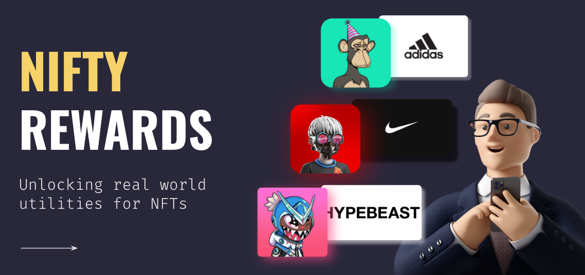
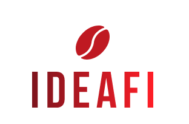
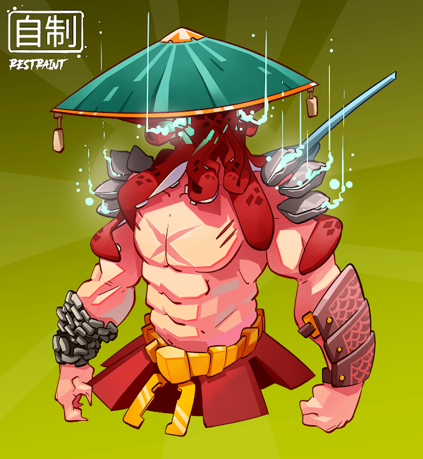
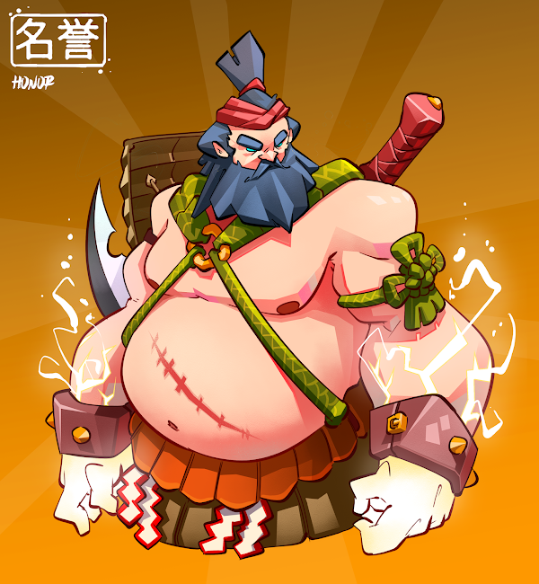
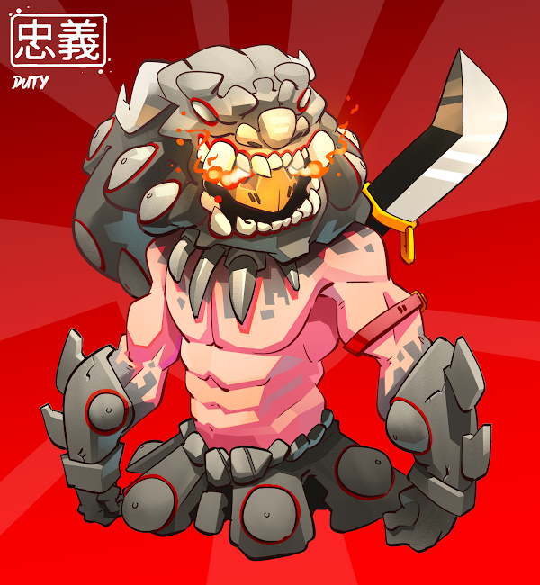

<!-- markdownlint-disable MD033 -->

<h1 align="center">Sean's GitHub</h1>

 
Credits to <a href="https://github.com/2manslkh">@2manslkh </a> for the sick template

Welcome to my humble profile. I am a blockchain developer who started out in the web3 space in mid 2021. I have a strong passion in the NFT vertical of blockchain and other than being an avid JPEG collector, I am also a degenerate leverage trader in my free time. #WAGMI

# **Projects** 📑

# 🎁 Nifty Rewards - NFT Reward Discovery Platform (ETHAmsterdam 2022)

The project was submitted as part of ETHAmsterdam 2022 organized by ETHGlobal. Our group identified a key problem with NFTs and it is the struggle for teams to provide utilities. A fully digital metaverse is not here yet and people will always still seek comfort in tangible brands. Today, we have millions of brands and services out there looking for consumers but there is no easy way for them to tap on the users and liquidity accumulated in the NFT ecosystem.

Bigger brands like Nike and Adidas have the purchasing power to buy over successful NFT collections but what about the 99% of merchants out there? Our platform serves as a Discovery Reward platform for users and a one-stop platform to kickstart merchant-nft reward campaigns. Onboarding web2 users and merchants is seamless with the use of technologies like web3Auth and walletConnect.

Find out more about the project at our repository:

 

# 💰 IdeaFi - Decentralized Crowdfunding

Smart Contract for a crowdfunding Dapp that removes the need for middleman commissions charged by traditional web2 applications.

Users are able to create crowdfund campaigns and also contribute to existing campaigns. To prevent malicious actors, the raised funds are stored in the smart contract and released based on a decentralized voting system for each spending request. The backend is based entirely on Smart Contract storage and the frontend is built using React and Next, hosted on Vercel.

 

# 🥷 ShogunSamurais - Ethereum NFT Project

Co-founder and blockchain developer for ShogunSamurais. Created ERC721 Smart Contract for the sale of 8888 ShogunSamurais. Project achieved an 84% sell out generating ~2M USD in revenue (based on Ethereum price).

Images and metadata were randomly generated using Node.js scripts and hosted on IPFS (nft storage).

# 🔓 ShogunSamurais - Staking & Rewards

In order to boost our utility ecosystem, our team introduced the $SHO token. Holders were able to stake their ShogunSamurai NFTs and generate $SHO tokens based on the NFTs that they were holding. Different combinations of guilds from the ShogunSamurais will allow for different rate of yields. We also introduced a Shogun Medallion which was airdropped on Polygon to all early holders (first 4444) which allows them to further boost their yield rates from staking.

# 💸 ShogunSamurais - SHO Token

ERC20 Token for the ShogunSamurais ecosystem. Generated from staking ShogunSamurais NFT.

 

## 🚀&nbsp;**Relatively Active Tech Stack**

## 🪛&nbsp;**Rusty Tech Stack**

`
